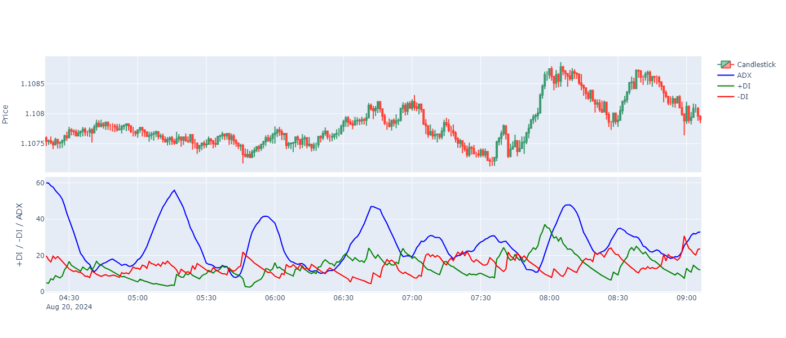

#  Average Directional Index (ADX) with python



This Python script visualizes the  Average Directional Index (ADX) indicator using both real-time and historical market data.The ADX is a popular technical analysis tool used to quantify the strength of a trend in the market.

## Prerequisites

Ensure you have the requirements file installed.

To install the libraries listed in the `requirements.txt` file, use the following command:

```sh
pip install -r requirements.txt
```

## Environment Variables

Create a `.env` file in your project directory and add your `CLIENT_ID` and `CLIENT_SECRET`:

```env
CLIENT_ID=your_client_id
CLIENT_SECRET=your_client_secret
```

These variables enable secure access to market data from the [HSTRADER](https://staging.hstrader.com/login) platform.

**Reminder:**
Your unique `CLIENT_ID` and `CLIENT_SECRET` can be obtained from your personal account on the platform. Ensure you keep them confidential to protect your data.

### Average Directional Index (ADX) Overview

The Average Directional Index (ADX) is used to determine the strength of a trend, whether it's an upward or downward trend. It is a non-directional indicator, meaning it quantifies trend strength regardless of trend direction.

### Components of ADX Analysis

1. **ADX Line:**
   - Measures the strength of the trend.
   - Values above 25 indicate a strong trend, while values below 20 suggest a weak trend or a range-bound market.

2. **+DI (Positive Directional Indicator):**
   - Measures the strength of the upward movement.
   - When +DI is above -DI, the market is in an uptrend.

3. **-DI (Negative Directional Indicator):**
   - Measures the strength of the downward movement.
   - When -DI is above +DI, the market is in a downtrend.

### Why Use ADX?

1. **Trend Strength Measurement:**
   - Helps traders determine whether the market is trending or range-bound.

2. **Signal Validation:**
   - ADX, combined with +DI and -DI, can validate trade signals, offering insights into potential market entries and exits.

3. **Versatile Tool:**
   - Works well across various time frames and asset classes, making it a reliable tool for traders.

 
 ## Conclusion

This script offers a powerful tool for forex traders, providing real-time market analysis using the ADX indicator. Whether you're monitoring a specific forex pair or analyzing market trends, this script helps you stay ahead by offering insights into trend strength and potential market movements.